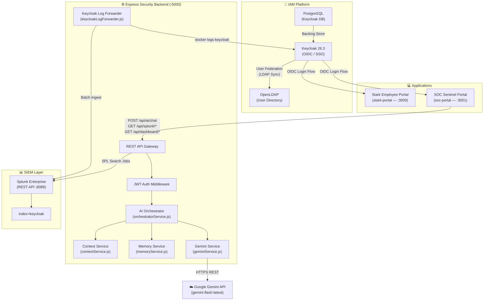
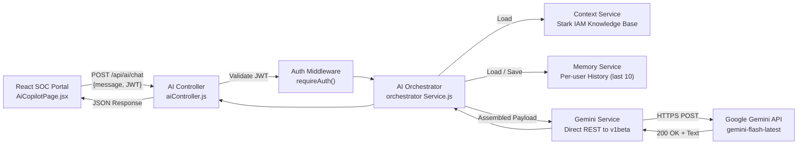

# Stark Industries IAM Lab

> An enterprise-grade **Identity & Access Management** home lab built around **Keycloak**, **OpenLDAP**, **Splunk**, and a custom AI Security Copilot — **JARVIS**.


---

## What Is This?

The **Stark Industries IAM Lab** is a full end-to-end identity and security operations platform designed to replicate real-world enterprise IAM infrastructure. It covers the entire lifecycle: directory provisioning → identity federation → OIDC authentication → SIEM ingestion → AI-powered threat analysis.

Built as a personal project to demonstrate hands-on depth in IAM engineering, SOC operations, and AI integration.

---

## Architecture

### Full System Architecture



### JARVIS AI Copilot Architecture



---

## Screenshots

### SOC Dashboard — Real Keycloak Telemetry


### JARVIS Security Copilot


### Security Alerts — Live Keycloak Events Indexed in Splunk


### Keycloak Login Page (Custom Stark Theme)


### Keycloak Realm — Groups Configuration


### OpenLDAP — Directory Structure with Apache Directory Studio


### System Architecture Diagram


### AI Pipeline Architecture


---

## Technology Stack

| Layer | Technology |
|---|---|
| **Identity Provider** | Keycloak 26.3 (OIDC, User Federation) |
| **User Directory** | OpenLDAP (osixia/openldap) |
| **Database** | PostgreSQL 17 |
| **SIEM** | Splunk Enterprise (REST API) |
| **Backend** | Node.js + Express.js (ESM) |
| **Auth Middleware** | JWT Bearer token validation (jsonwebtoken) |
| **AI Copilot** | Google Gemini (`gemini-flash-latest`) via direct REST |
| **Frontend** | React 18 + Vite + TailwindCSS |
| **Containerisation** | Docker + Docker Compose |
| **API Security** | Helmet, CORS, Morgan |

---

## Features

### 🔐 Identity & Access Management
- **OpenLDAP** directory with enterprise OUs: `People`, `Groups`, `Applications`, `Devices`, `Service Accounts`, `Executives`
- **Keycloak 26.3** configured with:
  - Custom `stark-industries` realm
  - LDAP user federation with sync
  - OIDC clients for both portals (`soc-portal`, `employee-portal`)
  - Group-based access control (`soc-portal-users`, `employee-portal-users`)

### 🖥️ Stark Employee Portal (`stark-portal`)
- React-based internal employee portal
- Keycloak OIDC SSO integration target
- Branded with Stark Industries identity

### 🛡️ SOC Sentinel Portal (`soc-portal`)
- **Dashboard** — Live Keycloak IAM telemetry: total logs, auth errors, session events, LDAP sync events, 24-hour trend chart
- **Alerts** — Real-time security events indexed from Keycloak into Splunk (`index=keycloak`), with severity classification
- **Search (SPL)** — Natural language → SPL query builder powered by JARVIS
- **JARVIS Copilot** — AI security assistant with persistent context and conversation memory

### 🤖 JARVIS AI Security Copilot
- **Identity** — Just A Rather Very Intelligent Security Assistant
- **Capabilities**:
  - IAM concept explanation (OIDC flows, JWT claims, LDAP, Keycloak events)
  - Natural language → Splunk SPL query generation
  - Security event analysis and threat summarisation
  - User profile lookup from the Stark IAM knowledge base
- **Architecture** — 4-layer pipeline: Controller → Orchestrator → Context/Memory → Gemini REST API
- **Memory** — Per-user conversation history (last 10 exchanges) stored in-process
- **Reliability** — Direct HTTPS REST calls to Gemini v1beta (bypasses SDK retry-on-429 hangs)

### 📊 SIEM Integration
- `keycloakLogForwarder.js` — non-blocking batch log collector that streams Keycloak Docker container stdout/stderr into Splunk `index=keycloak` every 10 seconds
- Splunk REST API integration for SPL search job execution from the SOC portal

---

## Project Structure

```
stark-industries-iam-lab/
├── docker-compose.yml          # OpenLDAP + PostgreSQL + Keycloak containers
├── .env.example                # Root environment variable template
├── HOW_TO_START.txt            # Full startup guide
│
├── backend/                    # Express.js Security Backend
│   ├── server.js               # Entry point, binds 0.0.0.0:5000
│   ├── .env.example            # Backend environment template
│   ├── config/
│   │   └── prompts.js          # JARVIS system prompt & capability definitions
│   ├── controllers/
│   │   └── aiController.js     # POST /api/ai/chat handler
│   ├── middleware/
│   │   └── auth.js             # JWT Bearer token validation
│   ├── routes/
│   │   ├── aiRoutes.js         # /api/ai/*
│   │   ├── splunkRoutes.js     # /api/splunk/*
│   │   └── dashboardRoutes.js  # /api/dashboard/*
│   └── services/
│       ├── geminiService.js    # Direct Gemini REST API wrapper
│       ├── orchestratorService.js  # AI capability router
│       ├── contextService.js   # IAM knowledge base context
│       ├── memoryService.js    # Per-user conversation memory
│       └── keycloakLogForwarder.js  # Keycloak → Splunk batch ingestion
│
├── soc-portal/                 # React SOC Sentinel Portal (Vite, port 3001)
│   └── src/
│       ├── pages/
│       │   ├── AiCopilotPage.jsx   # JARVIS chat interface
│       │   ├── DashboardPage.jsx   # IAM telemetry dashboard
│       │   ├── AlertsPage.jsx      # Security alerts table
│       │   └── SearchPage.jsx      # SPL search interface
│       ├── services/
│       │   └── splunkService.js    # Splunk REST client
│       └── components/
│           └── common/
│               └── Sidebar.jsx     # Navigation
│
├── stark-portal/               # React Employee Portal (port 3000)
│
└── screenshot/                 # Project screenshots and architecture diagrams
```

---

## Getting Started

### Prerequisites

| Requirement | Version |
|---|---|
| Docker Desktop | Latest |
| Node.js | v18+ |
| npm | v9+ |
| Google Gemini API Key | [Get one free](https://aistudio.google.com) |
| Splunk Enterprise | Optional (for full SIEM features) |

### 1. Clone the Repository

```bash
git clone https://github.com/YOUR_USERNAME/stark-industries-iam-lab.git
cd stark-industries-iam-lab
```

### 2. Configure Environment Variables

```bash
# Root .env (for Docker Compose)
cp .env.example .env

# Backend .env
cp backend/.env.example backend/.env
```

Open both `.env` files and fill in your credentials. The only key you **must** set to get JARVIS working is:

```env
GEMINI_API_KEY=your_key_from_aistudio.google.com
```

### 3. Start Docker Services (Keycloak + OpenLDAP + PostgreSQL)

```bash
docker compose up -d
```

Wait ~60 seconds for Keycloak to initialise. Verify with:

```bash
docker ps
# Expected: openldap, postgres, keycloak all "Up"
```

### 4. Start the Backend

```bash
cd backend
npm install
npm start
```

Verify: [http://127.0.0.1:5000/api/health](http://127.0.0.1:5000/api/health) → `{"status":"ok"}`

### 5. Start the SOC Portal

```bash
cd soc-portal
npm install
npm run dev
```

Open: [http://localhost:3001](http://localhost:3001)

### 6. (Optional) Configure Keycloak

After starting Docker:

1. Open [http://localhost:8080](http://localhost:8080)
2. Log in with `admin` / your `KEYCLOAK_ADMIN_PASSWORD`
3. Create the `stark-industries` realm
4. Create groups: `soc-portal-users`, `employee-portal-users`
5. Configure LDAP federation pointing to `openldap:389`

See [HOW_TO_START.txt](./HOW_TO_START.txt) for the complete step-by-step guide.

---

## API Reference

### Backend Endpoints

| Method | Endpoint | Auth | Description |
|---|---|---|---|
| `GET` | `/api/health` | None | Health check |
| `POST` | `/api/ai/chat` | JWT Bearer | JARVIS AI query |
| `GET` | `/api/dashboard/overview` | JWT Bearer | IAM telemetry summary |
| `GET` | `/api/splunk/search` | JWT Bearer | Execute SPL search |
| `GET` | `/api/splunk/alerts` | JWT Bearer | Fetch indexed alerts |

### JARVIS Chat Example

```bash
curl -X POST http://127.0.0.1:5000/api/ai/chat \
  -H "Content-Type: application/json" \
  -H "Authorization: Bearer <your_jwt_token>" \
  -d '{"message": "Show me failed login attempts for user tony in the last 24 hours"}'
```

Response:
```json
{
  "success": true,
  "response": "Here is the SPL query to retrieve failed login attempts for user 'tony':\n\nindex=keycloak type=LOGIN_ERROR user=tony earliest=-24h..."
}
```

---

## Security Notes

- `.env` files are excluded from git via `.gitignore` — **never commit them**
- The backend uses `helmet` for HTTP security headers
- All AI and data endpoints require a valid JWT Bearer token
- JWT tokens are decoded (not verified against Keycloak public key in dev mode — production should use JWKS verification)
- Splunk REST API connections use a self-signed TLS agent (`rejectUnauthorized: false`) — replace with proper certs in production

---

## What I Learned Building This

- **IAM Architecture** — Designing multi-tier identity systems with LDAP federation and OIDC flows from scratch
- **Keycloak Administration** — Realm configuration, client scopes, user federation, group-based access policies
- **SIEM Engineering** — Keycloak log ingestion pipelines, SPL query design, event classification
- **AI Integration** — Building a production-grade AI service layer with conversation memory, prompt engineering, and reliable API integration
- **Debugging Windows IPv6 stalls** — Chrome's `localhost` → `[::1]` resolution causing 60-second timeouts; fixed by binding Express to `0.0.0.0` and targeting `127.0.0.1` directly in the frontend
- **Node.js event loop management** — Refactoring blocking sequential `await` loops in log forwarders to non-blocking batch operations

---

## Roadmap

- [ ] Keycloak JWKS-based JWT signature verification in production mode
- [ ] JARVIS streaming responses (Server-Sent Events)
- [ ] Splunk dashboard embedded in SOC portal via iFrame
- [ ] Multi-tenant realm support
- [ ] JARVIS alert auto-triage and investigation reports
- [ ] Docker-compose profile for Splunk container

---

## License

MIT — free to use, learn from, and build upon.

---

*Built by Sujay CJ — IAM & Security Engineering Portfolio Project*
