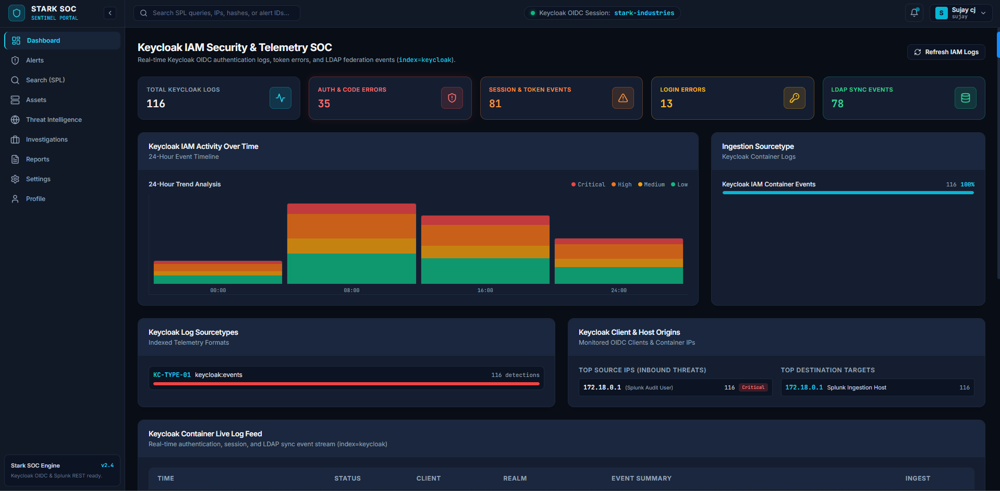
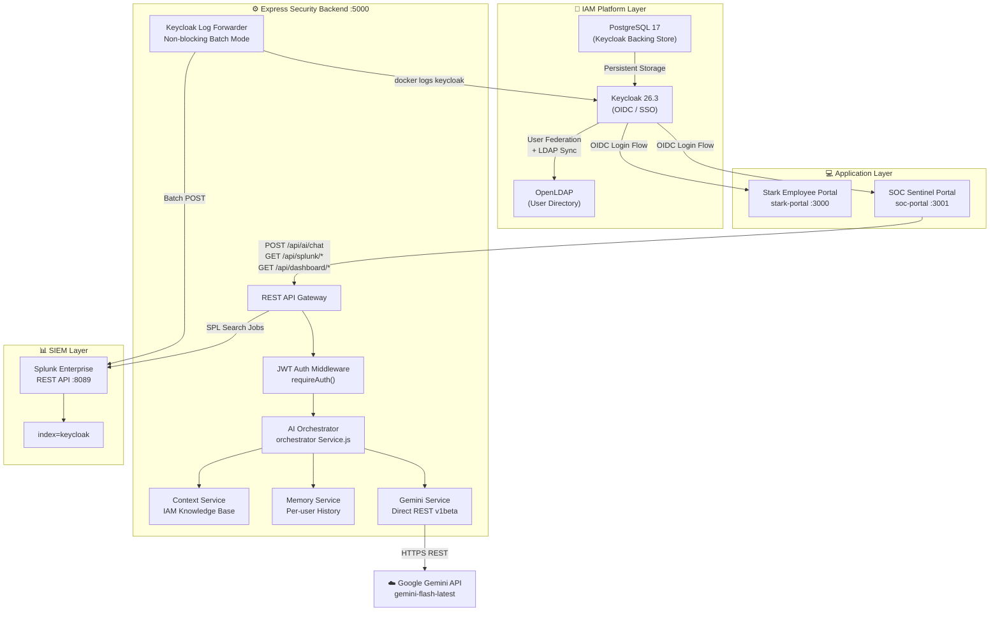
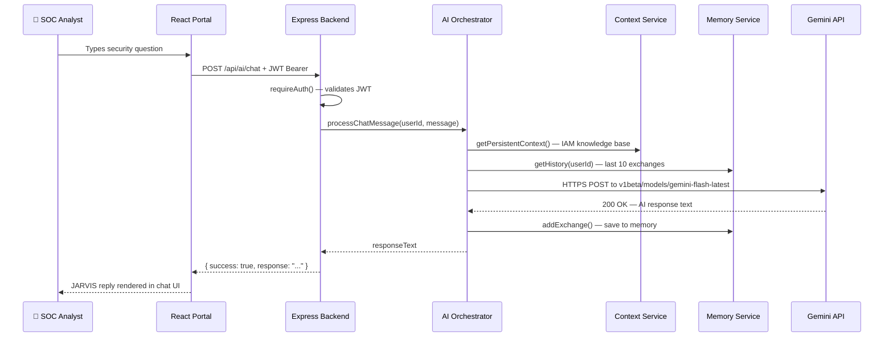
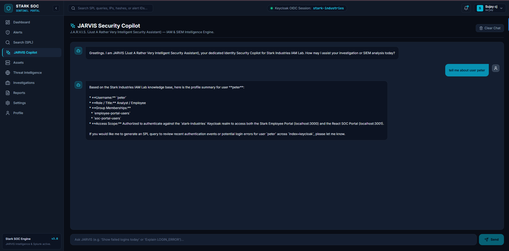
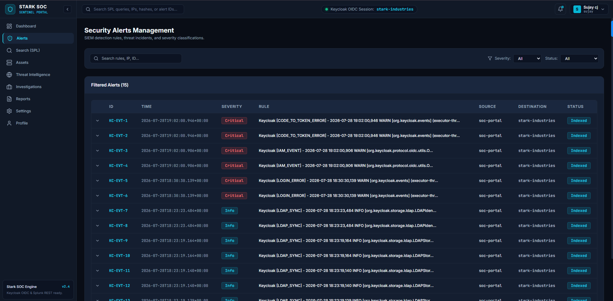
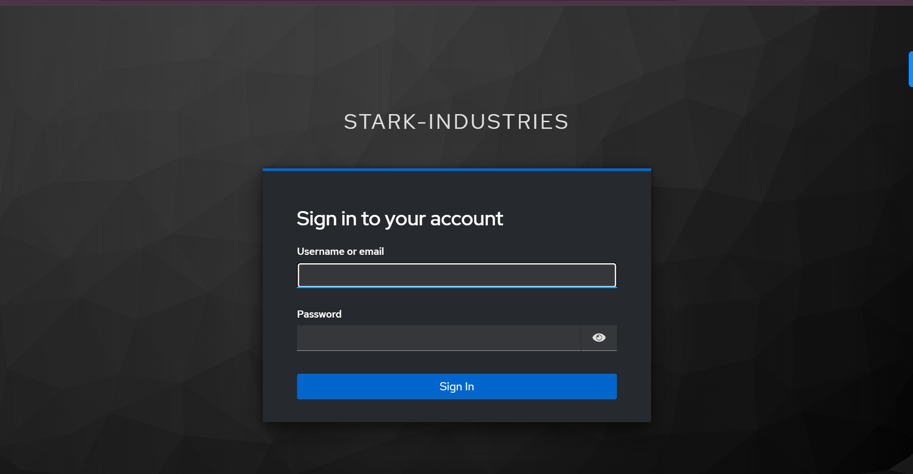
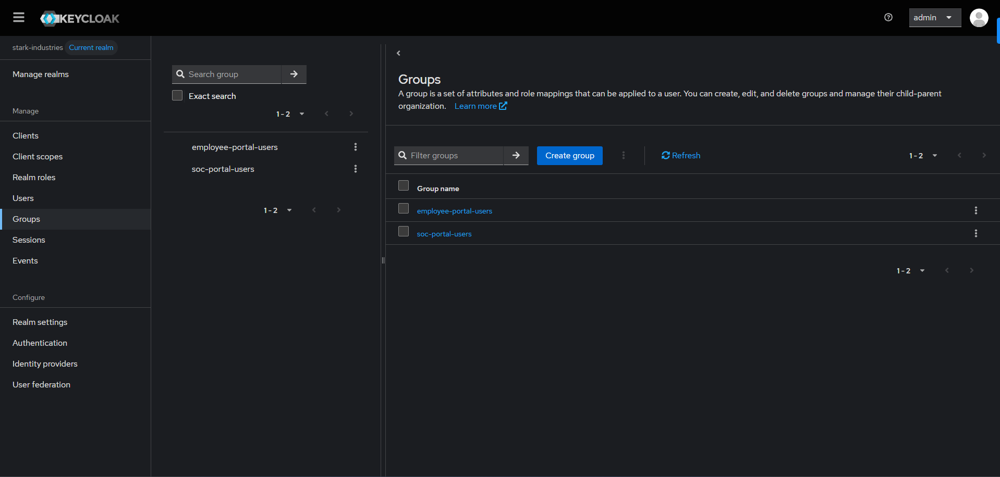
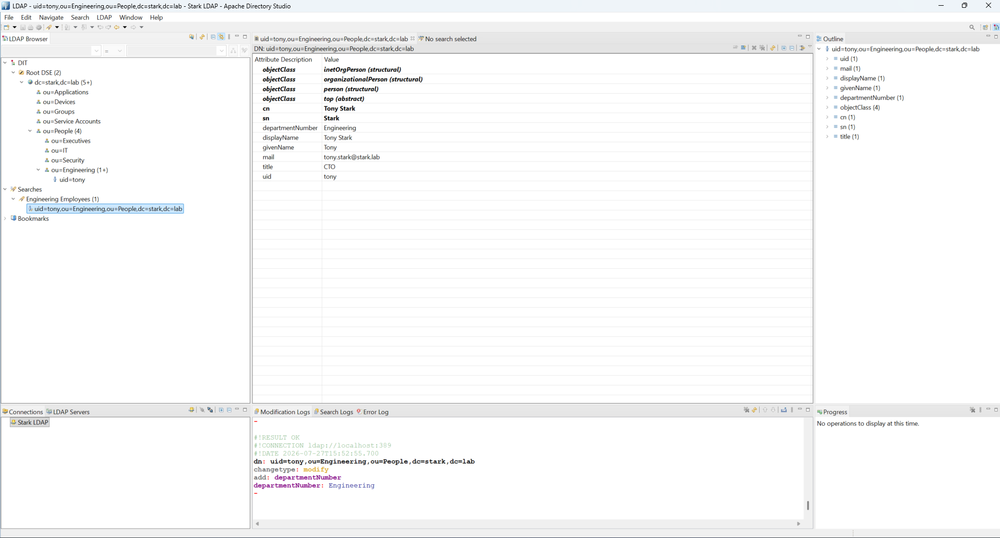
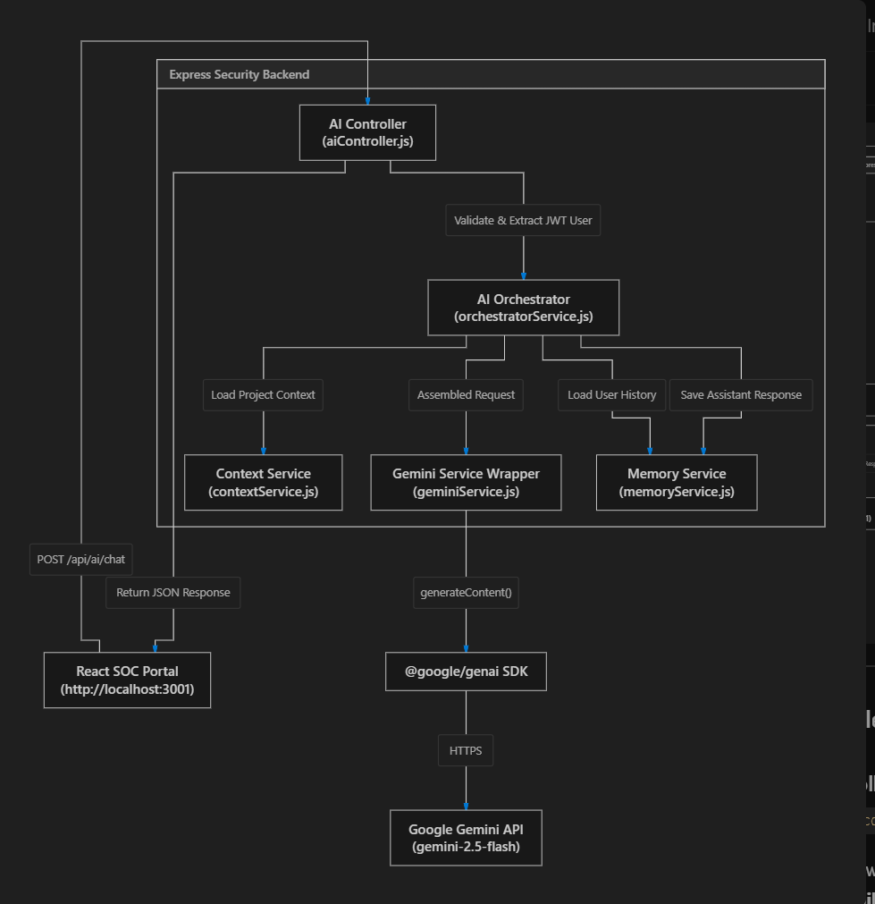

<div align="center">

# ⚡ Stark Industries IAM Platform

**Enterprise-grade Identity & Access Management home lab — built from the ground up.**

[](https://nodejs.org)
[](https://react.dev)
[](https://www.keycloak.org)
[](https://docker.com)
[](https://splunk.com)
[](https://ai.google.dev)
[](LICENSE)

*Keycloak OIDC · OpenLDAP Federation · Splunk SIEM · JARVIS AI Security Copilot*

</div>

---



---

## 🧠 What Is This?

The **Stark Industries IAM Platform** is a full end-to-end **identity security platform** that replicates real-world enterprise infrastructure. It covers the entire identity lifecycle:

```
Directory Provisioning → Identity Federation → OIDC Authentication → SIEM Ingestion → AI Threat Analysis
```

Built to demonstrate hands-on engineering depth across **IAM**, **SOC operations**, and **AI integration** — not a tutorial follow-along, but an original architecture designed, built, and debugged from scratch.

---

## 🏗️ Architecture

### Full System Architecture



### JARVIS AI Copilot Pipeline



---

## 📸 Screenshots

<table>
  <tr>
    <td align="center"><b>JARVIS Security Copilot</b></td>
    <td align="center"><b>SOC Security Alerts</b></td>
  </tr>
  <tr>
    <td></td>
    <td></td>
  </tr>
  <tr>
    <td align="center"><b>Keycloak Login (Custom Theme)</b></td>
    <td align="center"><b>Keycloak Groups — RBAC</b></td>
  </tr>
  <tr>
    <td></td>
    <td></td>
  </tr>
  <tr>
    <td align="center"><b>OpenLDAP Directory — Apache Directory Studio</b></td>
    <td align="center"><b>Stark Employee Portal</b></td>
  </tr>
  <tr>
    <td></td>
    <td></td>
  </tr>
</table>

### Architecture Diagrams

| Full System (with SIEM) | JARVIS AI Pipeline |
|---|---|
|  |  |

---

## 🛠️ Technology Stack

| Layer | Technology | Purpose |
|---|---|---|
| **Identity Provider** | Keycloak 26.3 | OIDC SSO, user federation, group RBAC |
| **User Directory** | OpenLDAP (osixia/openldap) | Enterprise directory: People, Groups, Applications, Devices |
| **Database** | PostgreSQL 17 | Keycloak persistence |
| **SIEM** | Splunk Enterprise | Log indexing, SPL search, threat detection |
| **Backend** | Node.js + Express.js (ESM) | REST API gateway, AI routing, Splunk proxy |
| **Auth** | jsonwebtoken | JWT Bearer token validation |
| **AI Copilot** | Google Gemini `gemini-flash-latest` | Security intelligence, SPL generation |
| **Frontend** | React 18 + Vite + TailwindCSS | SOC portal, employee portal |
| **Containers** | Docker + Docker Compose | Keycloak, OpenLDAP, PostgreSQL |
| **Security** | Helmet, CORS, Morgan | HTTP hardening, request logging |

---

## ✨ Features

### 🔐 Identity & Access Management
- **OpenLDAP** enterprise directory with OUs: `People` → `Executives / Engineering / IT / Security`, `Groups`, `Applications`, `Devices`, `Service Accounts`
- **Keycloak 26.3** with:
  - Custom `stark-industries` realm
  - LDAP user federation with two-way sync
  - OIDC clients for both portals
  - Group-based access control (`soc-portal-users`, `employee-portal-users`)
  - Custom login theme branded for Stark Industries

### 🛡️ SOC Sentinel Portal
- **Dashboard** — Live Keycloak telemetry: total log count, auth errors, session events, LDAP sync events, 24-hour stacked bar chart
- **Alerts** — Real security events (`LOGIN_ERROR`, `CODE_TO_TOKEN_ERROR`, `IAM_EVENT`, `LDAP_SYNC`) ingested from Keycloak container logs into Splunk `index=keycloak` and displayed with severity classification
- **Search (SPL)** — JARVIS-powered natural language → Splunk SPL conversion
- **JARVIS Copilot** — Full AI chat with persistent knowledge and memory

### 🤖 JARVIS — AI Security Copilot

> **J**ust **A** **R**ather **V**ery **I**ntelligent **S**ecurity **A**ssistant

| Capability | Description |
|---|---|
| **IAM Explanation** | Explains Keycloak events, OIDC flows, JWT claims, LDAP operations |
| **SPL Generation** | Converts natural language to Splunk search queries |
| **Threat Analysis** | Summarises indexed security events and identifies patterns |
| **User Lookup** | Profiles users from the Stark IAM knowledge base |
| **Conversation Memory** | Retains last 10 exchanges per user for contextual answers |

**Architecture:** 4-layer pipeline — Controller → Orchestrator → Context+Memory → Gemini REST API. Uses direct HTTPS to `v1beta` endpoint (bypasses SDK retry-on-429 hangs).

### 📊 SIEM Pipeline
- `keycloakLogForwarder.js` collects Keycloak Docker container logs every 10 seconds
- Batch-posts to Splunk `index=keycloak` via REST API (`/services/receivers/simple`)
- Non-blocking async design — doesn't stall the Node.js event loop

---

## 📁 Project Structure

```
stark-industries-iam-platform/
│
├── 📄 docker-compose.yml          # OpenLDAP + PostgreSQL + Keycloak
├── 📄 .env.example                # Root environment variable template
├── 📄 HOW_TO_START.txt            # Full startup guide
├── 📄 README.md
│
├── 📂 backend/                    # Express.js Security Backend
│   ├── server.js                  # Entry point — binds 0.0.0.0:5000
│   ├── .env.example
│   ├── config/
│   │   └── prompts.js             # JARVIS system prompt + capability definitions
│   ├── controllers/
│   │   └── aiController.js        # POST /api/ai/chat
│   ├── middleware/
│   │   └── auth.js                # JWT Bearer validation
│   ├── routes/
│   │   ├── aiRoutes.js            # /api/ai/*
│   │   ├── splunkRoutes.js        # /api/splunk/*
│   │   └── dashboardRoutes.js     # /api/dashboard/*
│   └── services/
│       ├── geminiService.js       # Direct Gemini REST API (no SDK)
│       ├── orchestratorService.js # AI capability router + intent detection
│       ├── contextService.js      # IAM knowledge base context loader
│       ├── memoryService.js       # Per-user conversation history (Map)
│       └── keycloakLogForwarder.js # Keycloak → Splunk batch ingestion
│
├── 📂 soc-portal/                 # React SOC Sentinel Portal (Vite, :3001)
│   └── src/
│       ├── pages/
│       │   ├── AiCopilotPage.jsx  # JARVIS chat UI
│       │   ├── DashboardPage.jsx  # Live IAM telemetry dashboard
│       │   ├── AlertsPage.jsx     # Splunk-indexed alert table
│       │   └── SearchPage.jsx     # SPL search interface
│       └── services/
│           └── splunkService.js   # Splunk REST client
│
├── 📂 stark-portal/               # React Employee Portal (Vite, :3000)
│
└── 📂 screenshot/                 # 24 screenshots + architecture diagrams
```

---

## 🚀 Getting Started

### Prerequisites

| Tool | Version | Notes |
|---|---|---|
| Docker Desktop | Latest | Must be running |
| Node.js | v18+ | For backend + frontend |
| Gemini API Key | — | [Get free key](https://aistudio.google.com) |
| Splunk Enterprise | 9.x | Optional — for full SIEM features |

### 1. Clone

```bash
git clone https://github.com/sujay-cj/stark-industries-iam-platform.git
cd stark-industries-iam-platform
```

### 2. Configure Environment

```bash
cp .env.example .env
cp backend/.env.example backend/.env
```

Edit both `.env` files. The only required key to get JARVIS working:

```env
GEMINI_API_KEY=your_key_from_aistudio.google.com
```

### 3. Start Docker Services

```bash
docker compose up -d
# Wait ~60s for Keycloak to boot
docker ps  # Verify: openldap, postgres, keycloak all "Up"
```

Keycloak Admin: [http://localhost:8080](http://localhost:8080) → `admin` / your `KEYCLOAK_ADMIN_PASSWORD`

### 4. Start Backend

```bash
cd backend
npm install
npm start
# Verify: http://127.0.0.1:5000/api/health → {"status":"ok"}
```

### 5. Start SOC Portal

```bash
cd soc-portal
npm install
npm run dev
# Open: http://localhost:3001
```

> 📖 For the complete step-by-step guide including Keycloak realm setup, see **[HOW_TO_START.txt](./HOW_TO_START.txt)**

---

## 📡 API Reference

| Method | Endpoint | Auth | Description |
|---|---|---|---|
| `GET` | `/api/health` | None | Health check |
| `POST` | `/api/ai/chat` | JWT Bearer | JARVIS AI query |
| `GET` | `/api/dashboard/overview` | JWT Bearer | IAM telemetry summary |
| `GET` | `/api/splunk/search` | JWT Bearer | Execute SPL search |
| `GET` | `/api/splunk/alerts` | JWT Bearer | Fetch indexed alerts |

**Example — Ask JARVIS:**

```bash
curl -X POST http://127.0.0.1:5000/api/ai/chat \
  -H "Content-Type: application/json" \
  -H "Authorization: Bearer <jwt_token>" \
  -d '{"message": "Show me all failed login attempts for user tony in the last 24 hours"}'
```

```json
{
  "success": true,
  "response": "Here is the SPL query:\n\nindex=keycloak type=LOGIN_ERROR user=tony earliest=-24h | table _time, user, type, client, realm"
}
```

---

## 🔒 Security Design

- **`.env` files are gitignored** — credentials never leave your machine
- **Helmet** sets security headers on every response
- **All AI + data endpoints** require a valid JWT Bearer token — unauthenticated requests get `401`
- **CORS** restricted to known portal origins (`localhost:3000`, `localhost:3001`)
- **Splunk TLS** uses a self-signed cert agent in dev — replace with proper CA in production
- **JWT** decoded but not signature-verified in dev mode — production should use Keycloak JWKS endpoint

---

## 🧱 Engineering Challenges Solved

| Problem | Root Cause | Solution |
|---|---|---|
| JARVIS timing out in browser (60s) | `requireAuth` factory passed without `()` — `next()` never called | Added `()` to `router.use(requireAuth())` |
| `@google/genai` SDK hanging on 429 | SDK silently retries rate-limit errors indefinitely | Rewrote `geminiService.js` as direct HTTPS REST calls |
| Chrome timing out on `localhost:5000` | Windows 11 resolves `localhost` to IPv6 `[::1]` first | Bound Express to `0.0.0.0`, frontend targets `127.0.0.1` |
| Log forwarder blocking event loop | 50 sequential `await axios.post()` calls per 5s interval | Replaced with single batch POST payload per interval |

---

## 🗺️ Roadmap

- [ ] Keycloak JWKS-based JWT signature verification
- [ ] JARVIS streaming responses via Server-Sent Events
- [ ] JARVIS alert auto-triage — auto-generates investigation reports
- [ ] Multi-tenant realm support
- [ ] Docker Compose profile for Splunk container
- [ ] OpenLDAP schema extensions for Stark department attributes

---

## 📜 License

MIT — free to use, fork, and build upon.

---

<div align="center">

**Built by [Sujay CJ](https://github.com/sujay-cj)**

*IAM & Security Engineering Portfolio Project*

⭐ Star this repo if you found it useful!

</div>
